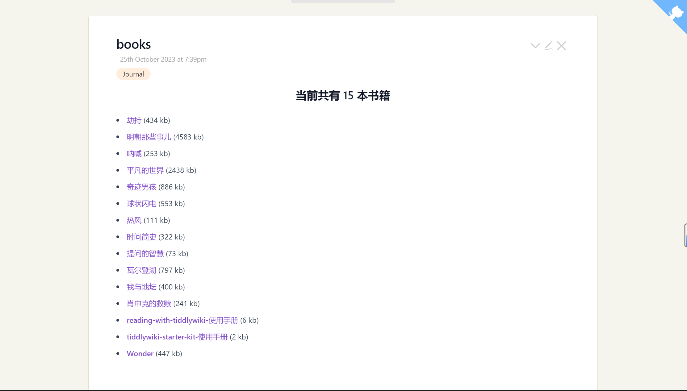

* [Get Started](https://tw-read.vercel.app/#reading-with-tiddlywiki-%E4%BD%BF%E7%94%A8%E6%89%8B%E5%86%8C)

> [!NOTE]
> 更新中 ...

## TODO

- [x] learn use calibre to make better epub with markdown-output calibre plugins
- [x] 改进脚本
- [x] 使用插件的形式分发书籍
- [x] 分段
- [x] convert single markdown to multi markdownfiles [main](./src/main.js)
- [x] pin story river list
- [x] toc metadat to better support
- [x] 也支持 wikitext, 为了符合中文阅读习惯, 段落开头空两格. ~~但是 tw 会自动 trim, 需要特殊处理一下~~, markdown-it 本身就不支持
- [x] 空格文件保存失败
- [x] 使用 prompt, chalk, ora
- [x] 测试脚本的细微 bug, 比如部分文本丢失， 如何处理链接
- [x] 添加相关 cover 图片到 images 文件夹
- [x] 书籍封面图片: 如何自动化这个过程
- [x] 书籍 metadata 信息: 自动化
- [x] 支持next/previous link
- [x] 支持进度追踪
- [x] 重新排列 tag list, 也许是使用 list: xxx(增加了插件大小)
- [x] 更完善的标题检测, 目前不能包含符号
- [ ] add books plugin library, 也许使用 modern.dev 也可以
- [ ] 统计插件大小
- [ ] plugin version automatic update by github tag
- [ ] html to md ???