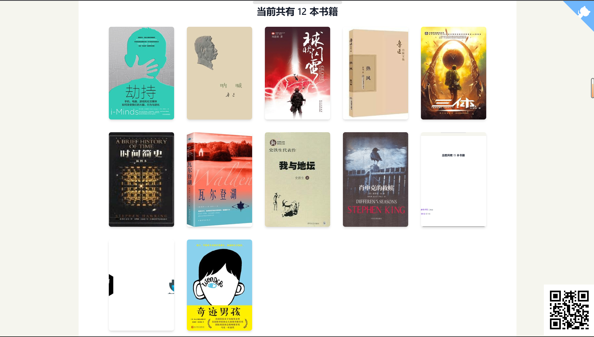

[reading book with tiddlywiki page](https://oeyoews.github.io/reading-books-with-tiddlywiki/)

> 只需要上传通过 calibre 转换后的 markdown 文件， 即可自动制作对应的书籍插件, 支持 wikitext(这很 tiddlywiki)

## books

- 平凡的世界
- 明朝那些事儿
- 劫持
- 球状闪电
- 肖申克的救赎
- 提问的智慧

> 列表不再更新， 最新书籍列表请查看 https://oeyoews.github.io/reading-books-with-tiddlywiki/#books

## TODO

- [x] learn use calibre to make better epub with markdown-output calibre plugins
- [x] 改进脚本
- [x] 使用插件的形式分发书籍
- [x] 分段
- [x] convert single markdown to multi markdownfiles [main](./src/main.js)
- [x] pin story river list
- [x] toc metadat to better support
- [x] 也支持 wikitext, 为了符合中文阅读习惯, 段落开头空两格. ~~但是 tw 会自动 trim, 需要特殊处理一下~~, markdown-it 本身就不支持
- [x] 空格文件保存失败
- [x] 使用 prompt, chalk, ora
- [x] 测试脚本的细微 bug, 比如部分文本丢失， 如何处理链接
- [x] 添加相关 cover 图片到 images 文件夹
- [x] 书籍封面图片: 如何自动化这个过程
- [x] 书籍 metadata 信息: 自动化
- [x] 支持next/previous link
- [ ] 支持进度追踪
- [ ] add books plugin library, 也许使用 modern.dev 也可以
- [ ] 重新排列 tag list, 也许是使用 list: xxx(增加了插件大小)
- [ ] 统计插件大小
- [ ] plugin version automatic update by github tag


<!-- ```bash
vertopal convert EPUB_INPUT_FILE --to markdown
``` -->

> 此项目从想法诞生到基本完成耗时14个小时左右(写了一天)

## 添加书籍流程

* 下载你想要的书籍 epub 文件： https://zh.annas-archive.org/
* 使用 calibre 转换成 markdown(待更新). ~~convert epub to single markdown: https://www.vertopal.com/en/convert/epub-to-markdown~~
* 手动检查生成的 md 文件是否有问题， 比如章节重复，丢失.
* 将对应的 md 名称成 <bookname>.md, 放在 markdown 目录下面(图片在 images 目录下面)
* 更新 src/books.js
* 提交更新仓库， 等待 github action 自动打包书籍插件.

## NOTE

> 绝对不保证 100%转换， 可能会丢失部分信息

## 想要添加更多书籍 ?

https://github.com/oeyoews/reading-books-with-tiddlywiki/issues

## Creadits

本仓库所用素材均来源于互联网，仅作个人排版参考学习之用，请勿用于商业用途。如果喜欢本仓库的书籍，请购买正版。任何对书籍的修改、加工、传播，请自负法律后果。